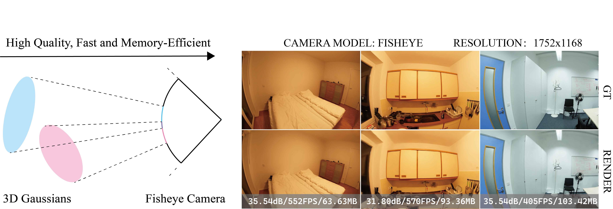

# Fisheye-GS

## Overview

Fisheye-GS is 3D Gaussian Splatting module for equidistant fisheye camera models. Fisheye-GS both supports efficient rendering and training.
[arxiv](https://arxiv.org/abs/2409.04751)
[code](https://github.com/zmliao/Fisheye-GS)
## Installation

### Requirements
+ CUDA-ready GPU with Compute Capability 7.0+
+ 24 GB VRAM (to train to paper evaluation quality)
+ Conda (recommended for easy setup)
+ C++ Compiler for PyTorch extensions
+ CUDA SDK 11 for PyTorch extensions
+ C++ Compiler and CUDA SDK must be compatible

### Setup

```bash
git clone https://github.com/zmliao/Fisheye-GS
cd Fisheye-GS
conda env create --file environment.yml
conda activate fisheye_gs
```

### Prepare Training Data on Scannet++ Dataset
The images from Scannet++ is captured by real fisheye-cameras. To convert them into ideal equidistant fisheye-cameras, you can apply:
```shell
python prepare_scannetpp.py \
    --path <path to your dataset> \
    --src images \
    --dst image_undistorted_fisheye 
```
Or simply use:
```shell
sh scripts/prepare.sh
```
## Training on Scannet++ Dataset
```shell
python train.py \
    -s <path to your dataset> \
    -m <path to model to be trained> \
    --iterations <integer, number of iterations> \
    --save_iterations <array of integers> \
    --test_iterations <array of integers> \
    --bs <the batch size> \
    --camera_model <FISHEYE/PINHOLE> \
    --train_random_background 
```
Or simply use:
```shell
sh scripts/train.sh
```
## Rendering on Scannet++ Dataset
```shell
python render.py \
    -s <path to your dataset> \
    -m <path to model to be trained> \
    --skip_train \
    --camera_model <FISHEYE/PINHOLE> \
    --ds <downsample> \
    -r 1
```
Or simply use
```shell
sh scripts/render.sh
```
## Evaluating
```shell
python metrics.py \
    -m <path to model to be trained>
```
Or simply use
```shell
sh scripts/eval.sh
```

## Results on Scannet++ Datasets

|Scene ID|Scene Name|PSNR|SSIM|LPIPS|
|-|-|-|-|-|
|0a5c013435|Utinity Room|26.42|0.894|0.177|
|bb87c292ad|Kitchen|30.63|0.933|0.179|
|e8ea9b4da8|Bedroom|31.89|0.946|0.191|
|8d563fc2cc|Office Night|26.15|0.905|0.177|
|fe1733741f|Office Day|24.96|0.849|0.223|

## License
Please follow the LICENSE of <a href='https://github.com/graphdeco-inria/gaussian-splatting'>3D-GS</a>.

## Acknowledgement
We thank all authors from <a href='https://github.com/graphdeco-inria/gaussian-splatting'>3D-GS</a> for presenting such an excellent work.

## Detailed Documentation
```{toctree}
:maxdepth: 1

fisheye_api
fisheye_derivation

