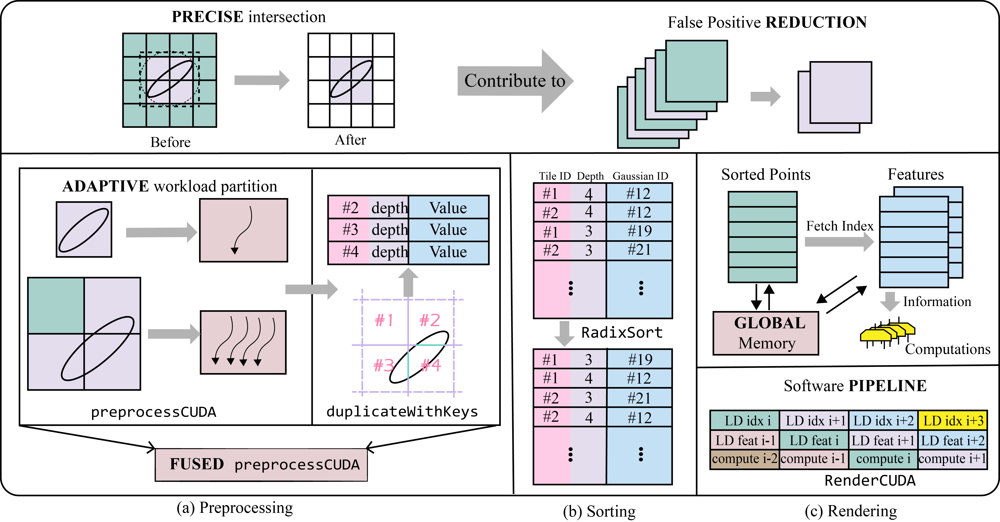
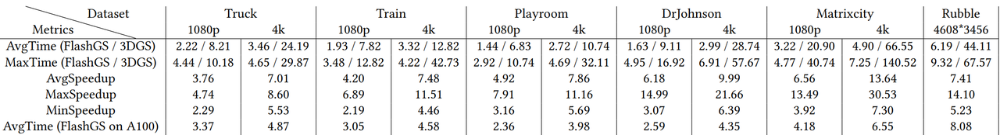
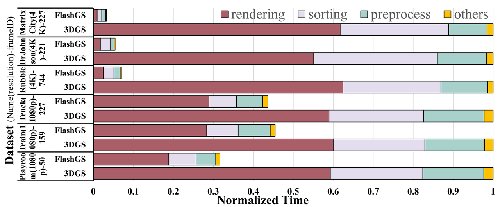
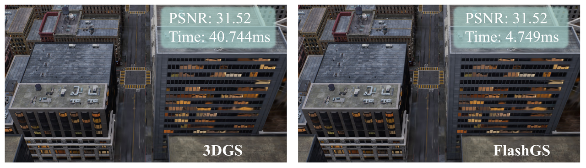

# FlashGS

## Abstract

3D reconstruction and real-time rendering are classic problems that can be efficiently conducted using GPUs, which are key components in various visual applications. Recently, the remarkable progress in 3D Gaussian Splatting (3DGS) has demonstrated huge potential over traditional rendering techniques and attracted considerable attention across both industry and academia. Despite the increasing power of GPUs, their potential remains underutilized due to massive redundancy and an inefficient rasterization pipeline of the original implementation of 3DGS. To address these issues, we proposed FlashGS, an open-source CUDA library with Python bind, with comprehensive algorithmic and low-level optimizations, encompassing redundancy elimination, efficient pipelining, refined parallel control and workload partition strategies, and assembly and memory optimizations. An extensive evaluation of FlashGS has been conducted across a diverse spectrum of synthetic and real-world 3D scenes, covering a variety of scene sizes up to 2.7𝑘𝑚2 cityscape and resolutions up to 4608×3456. We achieve up to 30.53× faster than 3DGS with an average of 7.2×, rendering at a minimum of 107 FPS.

## Evaluation

### Datasets
|Dataset|Scenes|Resolution|
|--|--|--|
|[Tanks&Temple](https://www.tanksandtemples.org/)| Train, Truck|1080p|
|[DeepBlending](https://repo-sam.inria.fr/fungraph/deep-blending/)| Drjohnson, Playroom|1080p|
|[MatrixCity](https://city-super.github.io/matrixcity/)|Smallcity|1080p|
|[Mills-19](https://github.com/cmusatyalab/mega-nerf)|Rubble|>4k|

FlashGS were compehensively tested on 6 representative datasets, which cover very different resolutions on a total of 11 scenes with hundreds or thousands of frames per scene.

### Overall Performance


### Source of Speedup

### Visual Quality


### BibTex
``` @article{feng2024flashgs,
  title={Flashgs: Efficient 3d gaussian splatting for large-scale and high-resolution rendering},
  author={Feng, Guofeng and Chen, Siyan and Fu, Rong and Liao, Zimu and Wang, Yi and Liu, Tao and Pei, Zhilin and Li, Hengjie and Zhang, Xingcheng and Dai, Bo},
  journal={arXiv preprint arXiv:2408.07967},
  year={2024}
}
```


## Setup
### Hardware Requirement
NVIDIA's server-grade and consumer-grade GPUs should work for our implementation. We have conducted our experiments on NVIDIA A100, V100, RTX 2080ti, RTX 3090, and RTX 4090 GPUs.

### Directories
- csrc/: Our CUDA C++ implementation of FlashGS. The optimized rendering kernels are under csrc/cuda_rasterizer/.
- example.py: An example to show how to use the installed FlashGS library.
- setup.py: A Python script to build, package, and install the FlashGS library.
- requirements.txt: Record some software dependencies when installing FlashGS.

### Installation
- Clone the [FlashGS](https://github.com/InternLandMark/FlashGS) project.
- Download the dependencies as we recommend.
- Use python setup.py install or pip install . to install FlashGS library.
- Run pip uninstall flash-gaussian-splatting before you compile and install the new version.

### Test
- Download the [pre-trained models](https://repo-sam.inria.fr/fungraph/3d-gaussian-splatting/datasets/pretrained/models.zip) , as well as the datasets.
- Run python example.py model_path.
- Open model_path/test_out and check the result.
 
## In-depth Documentation
```{toctree}
:maxdepth: 1

flashgs_api
