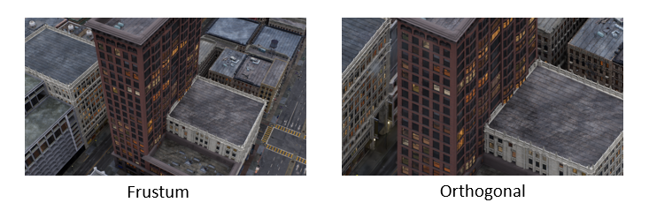
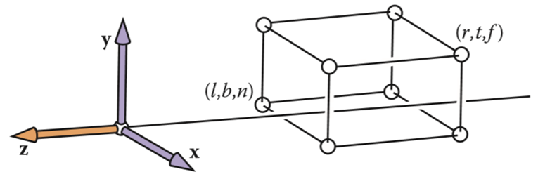
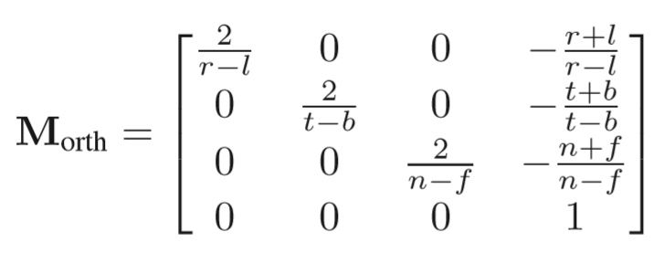

# Orthogonal-flash3dgs

## Overview

Orthogonal projections, also known as parallel projections, do not distort the near-large and far-small perspective projections. It is suitable for engineering surveying and mapping.



## Installation

### Directories
+csrc/: Our CUDA C++ implementation of FlashGS. The optimized rendering kernels are under +csrc/cuda_rasterizer/.
+example.py: An example to show how to use the installed FlashGS library.
+setup.py: A Python script to build, package, and install the FlashGS library.
+requirements.txt: Record some software dependencies when installing FlashGS.

### Requirements

+ CUDA-ready GPU with Compute Capability 7.0+
+ 24 GB VRAM (to train to paper evaluation quality)
+ Conda (recommended for easy setup)
+ C++ Compiler for PyTorch extensions
+ CUDA SDK 11 for PyTorch extensions
+ C++ Compiler and CUDA SDK must be compatible

### Setup
```
Clone the flash3dgs_orthogonal project.
Download the dependencies as we recommend.
Use python setup.py install or pip install . to install flash3dgs_orthogonal library.
Run pip uninstall flash3dgs_orthogonal-gaussian-splatting before you compile and install the new version.
```

## Test

```
Download the pre-trained models：https://repo-sam.inria.fr/fungraph/3d-gaussian-splatting/datasets/pretrained/models.zip, as well as the datasets.
Run python example.py model_path.
Open model_path/test_out and check the result.
```


## Related formulas

### Orthogonal projection matrix
The visual space defined by the orthogonal projection is a box-shaped visual space, which is composed of up, down, left, and right cutting planes, as well as near and far cut planes, as shown in the figure below, the faces near the origin are near the cut planes, and the farther ones are the far cut planes.




