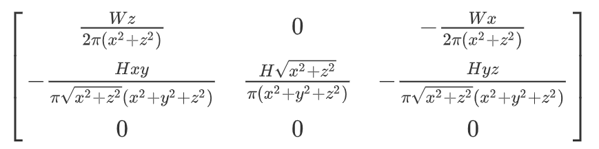
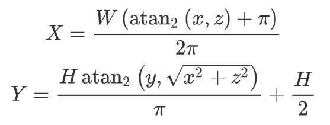

# panorama-op43dgs

## Overview

This tutorial is based on op43dgs, which minimizes the projection error in 3DGS.

## Installation

```sh
git clone https://github.com/LetianHuang/op43dgs
cd op43dgs
conda env create --file environment.yml
conda activate op43dgs
pip install submodules/diff-gaussian-rasterization-panorama
```

## Train

```sh
python train.py \
    -s <path to your dataset> \
    -m <path to model to be trained> \
    --iterations <integer, number of iterations> \
    --save_iterations <array of integers> \
    --test_iterations <array of integers> \
    --sh_degree 3
```

Or simply use:

```sh
sh scripts/train.sh
```

## Render

```sh
python render.py \
    -s <path to your dataset> \
    -m <path to model to be trained> \
    --iterations <integer, number of iterations> \
    --skip_train \
    --eval \
    --fov_ratio 1
```

Or simply use:

```sh
sh scripts/render.sh
```

## Evaluate

```
python -m <path to pre-trained model>
```

Or simply use:

```sh
sh scripts/eval.sh
```

## Results (pinhole vs panorama)

Mip-NeRF 360 Dataset - bicycle scene:


## Formula derivation

There are two main differences in code between the pinhole camera model and the panorama camera model: the calculation of Jacobi matrix in `computeCov2D` kernel and the coordinate transformation in the `preprocessCUDA` kernel.

### Jacobi matrix:



### Coordinate Transformation:



